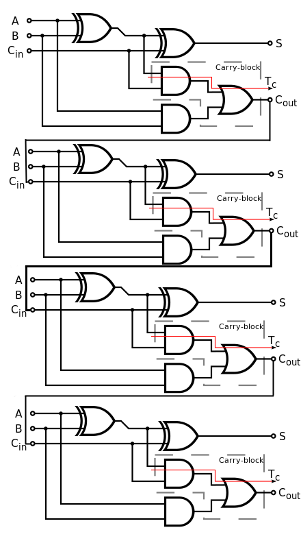

# BinaryAdder

A simple binary adder implementation using logic gates in C.

## What is a Binary Adder?

A *Binary adder* is a digital circuit found in digital devices that adds binary numbers. It is used in many computer systems and 
ALUs (Arithmetic Logic Unit) in CPUs. It is based on the basic boolean algebra operations such as XOR, OR and AND. These operations
are called logic gates in electronics.

To understand how these logic gates are used to calculate two integer numbers in binary form, you should first understand how 
binary numbers are summed by hand. Therefore, let's take the example below. By the way, it is simplier to build adder for 4-bit 
(nibble) numbers first, we can then extend our adder for other integer data sizes (byte, word, dword etc.).

For example, let's add **4 (= 0b0100)** and **5 (=0b0101)**.

To add these numbers, what we would do normally is to write them out top-down, as in the first school.

But before examining the example, let's see the logic gates and their truth tables and try to remember
these tables because it will be useful to have some familiarity with these logic operations and their results.

So, the first one is [AND gate](https://en.wikipedia.org/wiki/AND_gate). If two inputs to this gate are true, the result is true, otherwise false.

 
|  A  |  B  |A AND B|
|:---:|:---:|:-----:|
|  0  |  0  |   0   |
|  0  |  1  |   0   |
|  1  |  0  |   0   |
|  1  |  1  |   1   |

The second one is [OR gate](https://en.wikipedia.org/wiki/OR_gate). If both two inputs are false, the result false, otherwise true.

|  A  |  B  | A OR B |
|:---:|:---:|:------:|
|  0  |  0  |    0   |
|  0  |  1  |    1   |
|  1  |  0  |    1   |
|  1  |  1  |    1   |

And the last one is [XOR gate](https://en.wikipedia.org/wiki/XOR_gate). If the two inputs to the gate are different, the output is true, otherwise false.

|  A  |  B  | A	XOR B |
|:---:|:---:|:-------:|
|  0  |  0  |     0   |
|  0  |  1  |     1   |
|  1  |  0  |     1   |
|  1  |  1  |     0   |

Now, to sum 4 and 5 in binary mode, what we will do is to sum the digits under the $2^0$ and write down the sum at the bottom. 

| ${2}^{4}$ | ${2}^{3}$ | ${2}^{2}$ | ${2}^{1}$ | ${2}^{0}$ | Decimal |
|:---------:|:---------:|:---------:|:---------:|:---------:|:-------:|
|          0|          0|          1|          0|          0|    4    |
|          0|          0|          1|          0|          1|    5    |
|           |           |           |           |          1|         |

Then, we move on the next column $2^1$.

| ${2}^{4}$ | ${2}^{3}$ | ${2}^{2}$ | ${2}^{1}$ | ${2}^{0}$ | Decimal |
|:---------:|:---------:|:---------:|:---------:|:---------:|:-------:|
|          0|          0|          1|          0|          0|    4    |
|          0|          0|          1|          0|          1|    5    |
|           |           |           |          0|          1|         |

We do the same for the third column. $1 + 1 = 2$ but since we are in binary mode and cannot use other than 1 and 0. We divide 2 by our base 2. The remainder 0 becomes the sum for the column and the quotient 1 becomes our carry for the next column. To save the carries, we introduce a new row.

| ${2}^{4}$ | ${2}^{3}$ | ${2}^{2}$ | ${2}^{1}$ | ${2}^{0}$ | Decimal |
|:---------:|:---------:|:---------:|:---------:|:---------:|:-------:|
|          0|      **1**|          0|          0|          0|         |
|          0|          0|          1|          0|          0|    4    |
|          0|          0|          1|          0|          1|    5    |
|           |           |          0|          0|          1|         |

And for the last column, we should sum both digits in the numbers and the carry value from the previous sum. Therefore, the sum of three digits will be 1. 

| ${2}^{4}$ | ${2}^{3}$ | ${2}^{2}$ | ${2}^{1}$ | ${2}^{0}$ | Decimal |
|:---------:|:---------:|:---------:|:---------:|:---------:|:-------:|
|          0|      **1**|          0|          0|          0|         |
|          0|          0|          1|          0|          0|    4    |
|          0|          0|          1|          0|          1|    5    |
|           |          1|          0|          0|          1|         |

The sum operation is done and the result is **0b1001** which is binary form of 9. Also, there is no overflow since the last column didn't produce a carry.

Now, let's take a look at the relationships between the sums in the columns and the logic gates.

For instance, let's look at the first column we added $0$ to $1$. The result is $1$, of course. If we add $1$ to $0$, the result $1$ and, if we sum $0$ and $0$ or $1$ and $1$, the result is $0$. This seems familiar? Yep, it is how XOR gate works. Okay, we can then use XOR gate to calculate the sum. But how about the carry? If we add $0$ to $1$, the carry is zero. If we add $1$ to $0$, it is zero again. Only if you add $1$ and $1$, we have a carry. And again, does it seems familiar? Yep, it is AND gate. Great, we can calculate both sum and carry using these two logic gates.

Let's see the logic diagram for the calculation of sum and carry with the logic gates.

This simple circuit is named **half-adder** and it does the calculation of sum and carry but it is not enough for us because there is a carry from the previous operation and it is not involved. So, we need to update it to a full one to calculate the sum and carry by involving the carry from previous addition. But how?

Let's see the cases where an input carry involves in the addition.

| $c_{in}$ |  A  |   B | $c_{out}$ | sum |
|:--------:|:---:|:---:|:---------:|:---:|
|     0    |   0 |  0  |     0     |  0  |
|     0    |   0 |  1  |     0     |  1  |
|     0    |   1 |  0  |     0     |  1  |
|     0    |   1 |  1  |     1     |  0  |
|     1    |   0 |  0  |     0     |  1  |
|     1    |   0 |  1  |     1     |  0  |
|     1    |   1 |  0  |     1     |  0  |
|     1    |   1 |  1  |     1     |  1  |

We have already covered the first 4 cases where the input carry $c_{in}$ is zero with a half-adder. Now, we have three inputs: two digits from the numbers themselves and one carry from the previous addition. We shall extend the half-adder. 

When the carry-in is one, the sum column is inverted. Let's look at the sum column when the carry is zero. If we compare the sum values where the carry is zero to the carry of one, we can notice that the sum values where the carry is one are equal to **(A XOR B) XOR $c_{in}$**. So, what we will do to extend our half adder to a full-adder is to add one more XOR gate that gets its inputs from the previous XOR gates' result and the carry-in. 

The next step is to calculate the carry. We have calculated the carry by using an AND gate with its inputs being A and B, the digits from the numbers. With this AND gate, we've handled the cases where the carry-in is zero. This AND gate is also surprisingly handling the cases where the carry is one and either of digits is one. So, we only need to handle the case where the carry is one and both digits are either zero or one. But it doesn't return the correct result when the carry is one and either of the digits is one. In that case, the carry-out must be one not zero. So, it is not enough on its own to calculate the carry-out. We need an extra logic here to combine it with the AND gate by using an OR gate so that when the AND gate returns zero, it must return one. How do we construct such a logic? One way is to input the **A XOR B** and $c_{in}$ into AND gate. I mean that:

$$
c_{out}=c_{in}\cdot \left (A \oplus B\right )
$$

Notice also that this expression is not enough itself. We have to combine  Finally, the carry-out and sum are calculated as follows.

$$
\begin{align}
sum &= \left(A \oplus B\right) \oplus c_{in} \\ 
c_{out} &= A \cdot B + c_{in}\cdot \left (A \oplus B\right ) \\
\end{align}
$$

And the final logic circuit of our full-adder looks like this:

## Adding n-bit Numbers Using n Full-adders

We can calculate the sum of two n-bit numbers by using n full-adders. For example, assume that we wish to add 4-bit numbers. In this case, we use 4 full-adders by inputting $c_{out}$ values from the previous full-adder into the $c_{in}$ of the next one.

The first $c_{in}$ is zero because there is no addition before it and when the last $c_{out}$ is one, it means that the addition was overflowed and four bits are not enough to hold the result of the addition. Typically, CPUs rise up an overflow flag by setting the bit at the corresponding index in a [status](https://en.wikipedia.org/wiki/Status_register) register (e.g. FLAGS in x86). 
This sequence of full-adders is called ripple-carry adder.

To see how all this can be turned into a C program, look at the code.